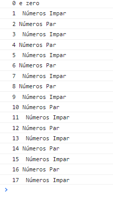

# exercicioRemoto2
;

# Índice
* Considere a quantidade de alunos presentes na sala,
 percorra do zero até o número total de alunos e retornar os seguintes resultados:
- se o número for par, escreva 'par' e o número correspondente.
- se o número for ímpar, escreva 'ímpar' e o número correspondente.
- se o número for zero, escreva 'zero' e o número correspondente.

## Tecnologias usadas:
- js

# Autor
- @mjpfelicia

